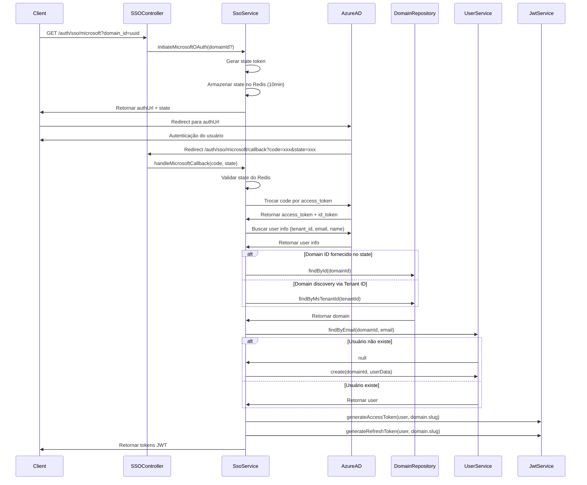

# Check-up Fase 1 e Plano Fase 3 SSO

## 1. Check-up Fase 1 - Fundação (Sprint 1-2)

### Status Atual vs Checklist Documentado

#### ✅ COMPLETO (12/13 itens):

- ✅ Setup do projeto (framework NestJS, estrutura TypeScript)
- ✅ Configuração PostgreSQL (migrations criadas)
- ✅ Configuração Redis (módulo implementado)
- ✅ Criação das migrations (8 migrations com domain_id)
- ✅ Implementação do modelo User (com domain_id FK)
- ✅ Hash de senhas com bcrypt (PasswordService)
- ✅ Endpoint `/auth/register` (domain-scoped)
- ✅ Endpoint `/auth/login` (domain-scoped)
- ✅ Geração de JWT (com domain_id no payload)
- ✅ Middleware de autenticação (JwtAuthGuard + JwtStrategy)
- ✅ Validação de tokens JWT (domain validation)
- ✅ Endpoint `/auth/refresh` (domain-scoped)
- ✅ Endpoint `/auth/logout` (implementado)

#### ⚠️ PARCIAL (1/13 itens):

- ⚠️ Testes unitários básicos - **NÃO-CONFORME**: Poucos ou nenhum teste encontrado

### Não-Conformidades Identificadas

1. **Testes Unitários Ausentes**

   - Não há arquivos `.spec.ts` visíveis na estrutura
   - Falta cobertura de testes para services críticos (AuthService, UserService, SsoService)
   - Recomendação: Criar testes para validação de isolamento de domínios

2. **Validação de Senhas com HaveIBeenPwned**

   - Documentação menciona validação contra lista de senhas vazadas
   - Implementação atual apenas valida força da senha (12 chars, maiúscula, minúscula, número, especial)
   - **Gap**: Falta integração com HaveIBeenPwned API

3. **Histórico de Senhas**

   - Documentação menciona "últimas 5 senhas não podem ser reutilizadas"
   - Implementação atual não verifica histórico
   - **Gap**: Falta tabela `user_password_history` e validação

---

## 2. Status Fase 3 - SSO (Sprint 5)

### Checklist Documentado vs Implementação

#### ✅ COMPLETO (Google OAuth):

- ✅ Configuração Google OAuth 2.0 (variáveis de ambiente)
- ✅ Endpoint `GET /auth/sso/google` (com domain_id opcional)
- ✅ Endpoint `GET /auth/sso/google/callback`
- ✅ Validação de state do OAuth (Redis, 10min TTL)
- ✅ Troca de código por token (axios)
- ✅ Busca de informações do usuário (Google API)
- ✅ Auto-criação de usuários SSO (domain discovery via email)
- ✅ Vinculação de contas (email existente no domínio)

#### ❌ FALTANDO (Microsoft OAuth):

- ❌ Configuração Microsoft Identity Platform
- ❌ Endpoint `GET /auth/sso/microsoft`
- ❌ Endpoint `GET /auth/sso/microsoft/callback`
- ❌ Domain discovery via Microsoft Tenant ID (conforme documentação)
- ❌ Mapeamento `ms_tenant_id` na tabela `domains`

#### ⚠️ PARCIAL:

- ⚠️ Testes de SSO - **NÃO IMPLEMENTADO**

---

## 3. Plano de Implementação - Fase 3 SSO

### Objetivo

Completar implementação de SSO conforme documentação, adicionando Microsoft OAuth 2.0 com domain discovery via Tenant ID e melhorando Google OAuth existente.

### Arquivos a Modificar/Criar

#### 3.1 Microsoft OAuth Implementation

**Novos Arquivos:**

- `src/users/application/services/sso-service/microsoft-sso.service.ts` (ou estender SsoService)
- `src/shared/strategies/microsoft.strategy.ts` (opcional, se usar Passport)
- DTOs para Microsoft OAuth (se necessário)

**Arquivos a Modificar:**

- `src/users/infrastructure/controllers/sso.controller.ts` - Adicionar endpoints Microsoft
- `src/users/application/services/sso-service/sso.service.ts` - Adicionar métodos Microsoft
- `src/domains/domain/entities/domain.entity.ts` - Adicionar campo `ms_tenant_id`
- `src/database/migrations/[timestamp]-AddMsTenantIdToDomains.ts` - Migration para novo campo
- `package.json` - Adicionar dependência `passport-azure-ad` ou `@azure/msal-node`

**Endpoints a Implementar:**

- `GET /auth/sso/microsoft?domain_id=uuid` - Iniciar fluxo OAuth
- `GET /auth/sso/microsoft/callback?code=xxx&state=xxx` - Callback OAuth

**Funcionalidades:**

- Domain discovery via Microsoft Tenant ID (mapear `ms_tenant_id` do Azure AD para `domain_id` do Une.cx)
- Auto-criação de usuário no domínio correto
- Vinculação de conta Microsoft a usuário existente
- Geração de JWT com `domain_id` após autenticação

#### 3.2 Melhorias no Google OAuth

**Arquivos a Modificar:**

- `src/users/application/services/sso-service/sso.service.ts` - Melhorar domain discovery
- Adicionar suporte a `domain_slug` além de `domain_id` no state

**Melhorias:**

- Melhorar lógica de domain discovery via email domain (atual usa slug simples)
- Adicionar fallback para múltiplos domínios com mesmo email domain
- Validar email domain mapping na tabela `domains` (se adicionar campo `email_domain`)

#### 3.3 Testes SSO

**Arquivos a Criar:**

- `src/users/application/services/sso-service/sso.service.spec.ts`
- `src/users/infrastructure/controllers/sso.controller.spec.ts`
- `test/e2e/sso.e2e-spec.ts`

**Cenários de Teste:**

- Google OAuth com domain_id fornecido
- Google OAuth com domain discovery via email
- Microsoft OAuth com tenant_id mapping
- Validação de state token
- Auto-criação de usuário SSO
- Vinculação de conta existente
- Isolamento entre domínios (usuário não pode autenticar em domínio diferente)

#### 3.4 Configuração e Variáveis de Ambiente

**Variáveis a Adicionar (.env):**

```bash
# Microsoft OAuth
MICROSOFT_CLIENT_ID=your-azure-app-id
MICROSOFT_CLIENT_SECRET=your-azure-secret
MICROSOFT_TENANT_ID=your-tenant-id (opcional, pode ser 'common' ou 'organizations')
MICROSOFT_REDIRECT_URI=https://api.une.cx/auth/sso/microsoft/callback
```

**Migration para ms_tenant_id:**

- Adicionar coluna `ms_tenant_id VARCHAR(255) NULL` na tabela `domains`
- Criar índice para busca rápida: `CREATE INDEX idx_domains_ms_tenant_id ON domains(ms_tenant_id)`

---

## 4. Estrutura de Implementação (Clean Architecture)

### Camadas a Seguir:

```
users/
├── application/
│   ├── services/
│   │   └── sso-service/
│   │       ├── sso.service.ts (estender com Microsoft)
│   │       └── microsoft-sso.service.ts (novo, opcional)
│   └── dtos/
│       └── microsoft-oauth.dto.ts (novo)
├── domain/
│   └── entities/
│       └── (domain.entity.ts será modificado)
└── infrastructure/
    ├── controllers/
    │   └── sso.controller.ts (modificar)
    └── repositories/
        └── (domain.repository.ts pode precisar método findByMsTenantId)
```

### Princípios Clean Architecture:

- **Domain Layer**: Entidade Domain com `ms_tenant_id`, sem lógica de negócio
- **Application Layer**: SsoService com métodos `initiateMicrosoftOAuth()` e `handleMicrosoftCallback()`
- **Infrastructure Layer**: Controller com endpoints, integração com Azure AD API
- **Shared**: Strategies (se usar Passport), tipos TypeScript

---

## 5. Fluxo Microsoft OAuth (Domain Discovery)



---

## 6. Checklist de Implementação Fase 3

### Microsoft OAuth:

- [ ] Instalar dependência `@azure/msal-node` ou `passport-azure-ad`
- [ ] Criar migration para adicionar `ms_tenant_id` em `domains`
- [ ] Atualizar Domain entity com campo `ms_tenant_id`
- [ ] Implementar `initiateMicrosoftOAuth()` no SsoService
- [ ] Implementar `handleMicrosoftCallback()` no SsoService
- [ ] Adicionar endpoint `GET /auth/sso/microsoft` no SsoController
- [ ] Adicionar endpoint `GET /auth/sso/microsoft/callback` no SsoController
- [ ] Implementar domain discovery via `ms_tenant_id`
- [ ] Adicionar variáveis de ambiente Microsoft OAuth
- [ ] Testar fluxo completo Microsoft OAuth

### Melhorias Google OAuth:

- [ ] Melhorar domain discovery via email domain
- [ ] Adicionar suporte a múltiplos domínios com mesmo email domain
- [ ] Validar mapeamento email domain (se adicionar campo `email_domain` em domains)

### Testes:

- [ ] Criar testes unitários para SsoService (Google + Microsoft)
- [ ] Criar testes de integração para endpoints SSO
- [ ] Criar testes de isolamento entre domínios
- [ ] Criar testes E2E para fluxo completo SSO

### Documentação:

- [ ] Atualizar Swagger com endpoints Microsoft
- [ ] Documentar variáveis de ambiente Microsoft
- [ ] Criar guia de configuração Azure AD
- [ ] Atualizar documentação de domain discovery

---

## 7. Próximos Passos Imediatos

1. **Criar migration para `ms_tenant_id`**
2. **Instalar dependência Microsoft OAuth**
3. **Implementar métodos Microsoft no SsoService**
4. **Adicionar endpoints Microsoft no SsoController**
5. **Criar testes básicos**
6. **Atualizar documentação**

---

## 8. Considerações de Segurança

- State token deve ser único e não previsível (já implementado com `randomBytes`)
- Validar expiração do state (10 minutos)
- Validar domain_id do token vs domain_id da requisição (já implementado)
- Rate limiting por domínio nos endpoints SSO (já implementado via ThrottlerDomainGuard)
- Validar email verificado do provedor SSO antes de criar usuário
- Logging de eventos SSO no audit_logs (a implementar na Fase 4)

---

## 9. Verificação de Etapas Concluídas

**Data da Verificação:** 2025-01-27

### Resumo da Verificação

**Status Geral:** ✅ **9/11 tarefas concluídas** (82%)

#### ✅ Tarefas Concluídas (9):
1. ✅ Migration para ms_tenant_id - **CONFIRMADO**
2. ✅ Dependência Microsoft OAuth (@azure/msal-node) - **CONFIRMADO**
3. ✅ Domain entity com ms_tenant_id - **CONFIRMADO**
4. ✅ Métodos Microsoft no SsoService - **CONFIRMADO**
5. ✅ Endpoints Microsoft no SsoController - **CONFIRMADO**
6. ✅ Domain discovery via ms_tenant_id - **CONFIRMADO**
7. ✅ Melhorias Google OAuth (múltiplas estratégias) - **CONFIRMADO**
8. ✅ Testes E2E SSO - **CONFIRMADO**
9. ✅ Swagger docs Microsoft OAuth - **CONFIRMADO**

#### ⚠️ Tarefas Pendentes (2):
1. ⚠️ Testes unitários para SsoService - **NÃO ENCONTRADO**
2. ⚠️ Variáveis de ambiente no .env.example - **ARQUIVO AUSENTE**

### Detalhes da Verificação

**Arquivos Verificados:**
- ✅ `src/database/migrations/1704067208000-AddMsTenantIdToDomains.ts` - Migration implementada
- ✅ `package.json` - Dependência @azure/msal-node instalada
- ✅ `src/domains/domain/entities/domain.entity.ts` - Campo ms_tenant_id adicionado
- ✅ `src/domains/infrastructure/repositories/domain.repository.ts` - Método findByMsTenantId implementado
- ✅ `src/users/application/services/sso-service/sso.service.ts` - Métodos Microsoft implementados
- ✅ `src/users/infrastructure/controllers/sso.controller.ts` - Endpoints Microsoft implementados
- ✅ `test/e2e/sso.e2e-spec.ts` - Testes E2E implementados
- ❌ `src/users/application/services/sso-service/sso.service.spec.ts` - **NÃO ENCONTRADO**
- ❌ `.env.example` - **ARQUIVO AUSENTE**

**Relatório Completo:** Ver arquivo `.cursor/VERIFICACAO_ETAPAS_CONCLUIDAS.md`

### Próximos Passos Recomendados

1. **Alta Prioridade:**
   - Criar testes unitários para SsoService (`sso.service.spec.ts`)
   - Criar arquivo `.env.example` com variáveis Microsoft OAuth

2. **Média Prioridade:**
   - Implementar validação HaveIBeenPwned (Fase 1 - gap identificado)
   - Implementar histórico de senhas (Fase 1 - gap identificado)

**Workflow Status:** ✅ Fase 3 SSO - 82% Concluída (Core funcional completo)